# 《RISC-V体系结构编程与实践》for DongshanPI-D1s

本分支提供基于DongShanPI D1s开发板验证过的《RISC-V体系结构编程与实践》实验参考代码，由韦东山团队提供技术支持。

DongShanPI D1s开发板购买方式如下：     
[DongShanPI D1s + RISC-V图书套餐 购买链接](https://item.taobao.com/item.htm?&id=695941169493)

实验环境：       
1. 主机硬件平台： DongshanPI-D1s开发板主板    
2. 主机操作系统：Windows10/ubuntu    
3. GCC版本：9（riscv64-linux-gnu-gcc）     
4. GDB版本：gdb-multiarch。    

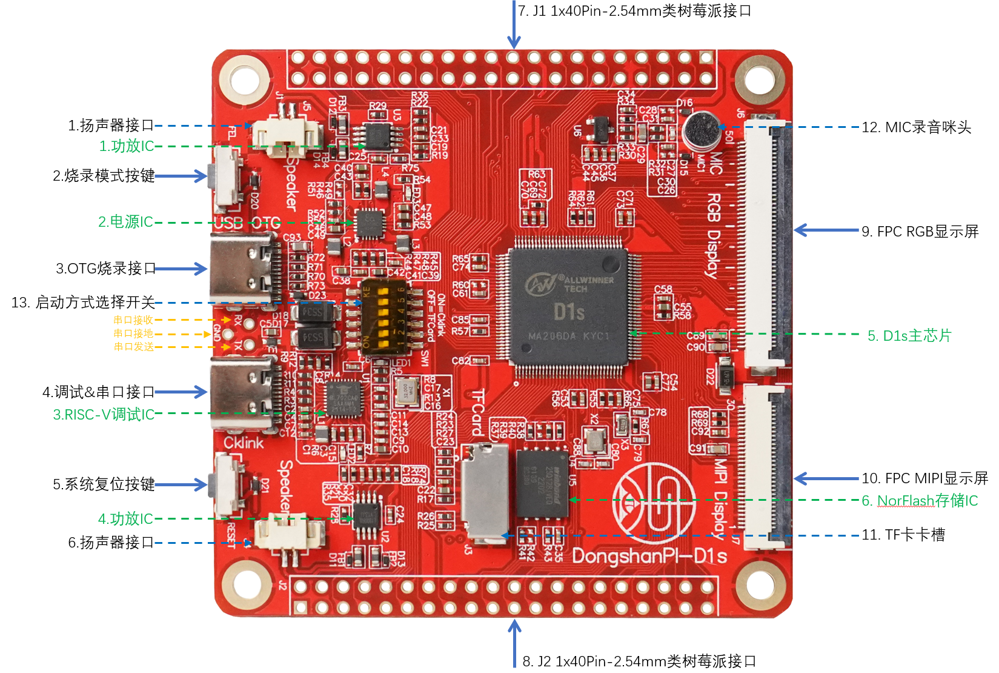

## 配置windows下开发环境

### 安装Git Bash

进入 **05_开发配套工具** 先安装 `Git-2.39.1-64-bit.exe`

在Windows下，Git名为msysGit，从 [https://gitforwindows.org](https://gitforwindows.org/) 上下载安装文件，双击安装即可，安装选项很多，使用默认选项即可。 如果下载慢，可以在百度上搜：Git-2.28.0-64-bit.exe，自行下载。

对于Windows或Linux，它们的命令行用法相似，对于Windows，进入Git命令行的方法是在 `开始->所有程序->Git` 下启动 Git Bash。 Git Bash的命令用法跟Linux完全一样，比如cd、ls等命令。

安装完成后可以参考下图来打开 git bash工具

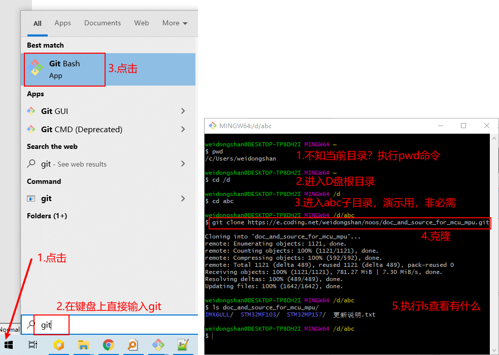

### 安装Cklink驱动软件

进入 **05_开发配套工具\CKLinkServer** 安装windows下`T-Head-DebugServer-windows-V5.16.6-20221102-1510.zip` 直接进行解压缩安装。

连接开发板另一条TypeC线至开发板 Cklink 接口此时设备管理器会多出来一个 Cklink-lite的设备。

此时我们长按开发板上的 **FEL按键** ，同时按一下 **RESET按键** 开发板就会自动进入调试模式。

这时打开 T-HeadDebugServer会自动显示设备的CPU 信息以及GDB端口连接地址。

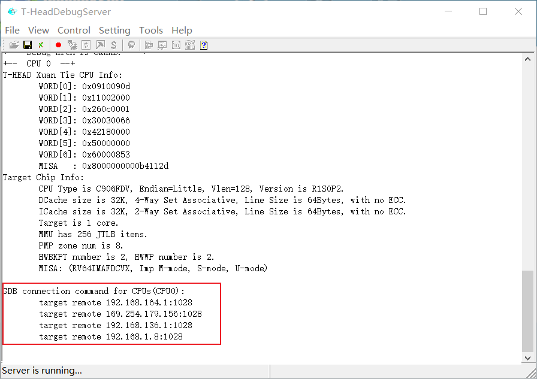

### 安装交叉编译工具链

进入到 **05_开发配套工具\toolchain** 目录，解压缩 `Xuantie-900-gcc-elf-newlib-mingw-V2.6.1-20220906.tar.gz`

解压缩完成后进入到 如下图红框所示这个目录 ，记住这个路径的完整目录(尽量不要包含中文) 然后将其 添加至系统的 Path环境变量内。

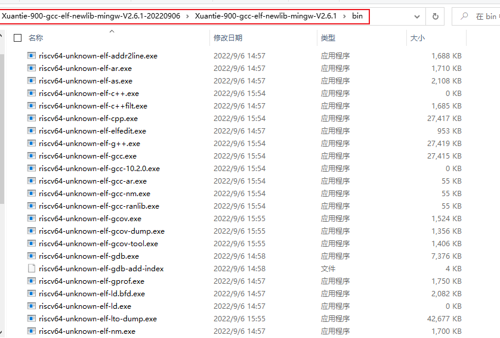

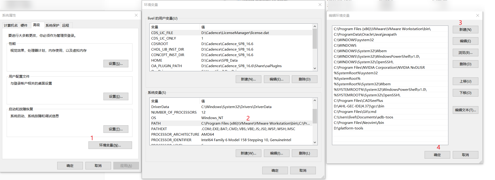

### 配置make工具

进入 **05_开发配套工具\Make** 目录内，双击 `make-3.81.exe`开始安装，安装时请注意一下安装所在路径，等待安装完成后 我们需要将此路径添加至系统环境变量里面。

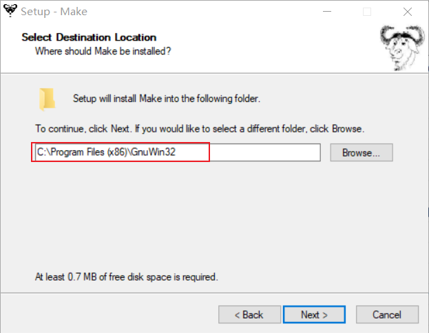

添加完成后如下图所示，之后我们可以通过git bash命令进行验证。

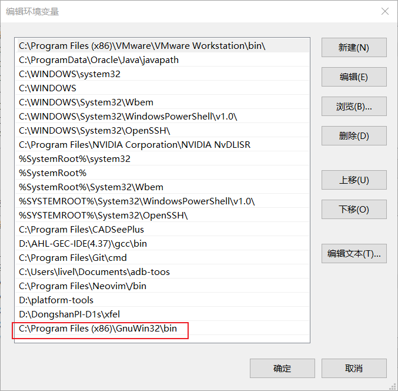

### 配置Xfel工具

进入 **05_开发配套工具\xfel目录内**，复制完整的路径，将其单独添加到 windows 环境变量内。

在windows下使用xfel烧录工具之前，我们需要先连接一条 Typec线至开发板OTG接口 连接成功后后，长按 **FEL按键** 此时按一下 **RESET按键** 开发板就会进入烧录模式，如果之前安装过 全志的usb烧写驱动，电脑的设备管理器会出来一个 usb device设备，表明已经进入烧写模式成功。如果你的电脑没有安装驱动，会提示一个 位置设备 https://dongshanpi.com/DongshanNezhaSTU/03-QuickStart/#usb 那么请参考这篇文章安装一下驱动。

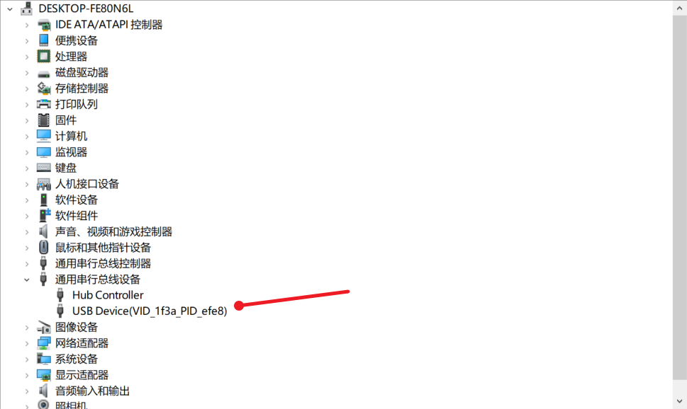

连接成功后，我们进入到 **05_开发配套工具\xfel\Drivers** 目录下，参考下图安装一下 **WinUSB**驱动，就可以使用xfel识别到设备了。

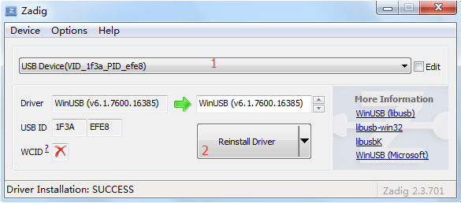

### 验证工具配置

打开git bash界面 来依次验证工具是否正常。

* 验证xfel烧录工具

先连接一条 Typec线至开发板OTG接口 连接成功后后，长按 **FEL按键** 此时按一下 **RESET按键** 开发板就会进入烧录模式,此时在 git bash终端里面 输入 `xfel.exe version`命令就可以识别到芯片的详细信息。

* 验证 交叉编译工具链

在 git bash输入` riscv64-unknown-elf-gcc -v ` 既可看到详细的工具链参数输出，表示已经配置成功

* 验证make 命令

在git bash输入`make -v`命令，如果可以显示出来版本，就表示已经可以使用。

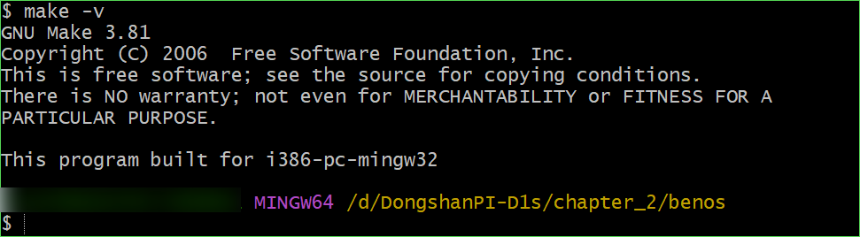

## 编译烧写程序

如下图为开发板的功能示意图，我们需要先将 配套的typec线 一根插至 黑色序号3. OTG烧录接口，用于进行供电和烧录系统操作。

首先进入到源码目录 **riscv_programming_practice-for-dongshan\chapter_2\benos** 在当前目录下，鼠标右键，点击 `git bash Here`

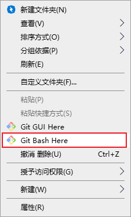

在源码目录下 执行` make clean`清理缓存，之后执行`make`命令开始编译，编译完成后，可以执行` make burn`来自动烧录镜像到开发板内，可以看到如下图所示。

注意：烧录开发板之前需要先将两根 typec线全都连接至开发板上，然后 长按 **FEL按键** 短按一下**RESET键** 进入烧录模式，之后就可以执行上述烧录步骤了，烧录完成后，可以使用串口工具 打开 Cklinke自带的 串口设备，波特率 115200 就可以看到程序的输出信息。

## 使用GDB 调试

