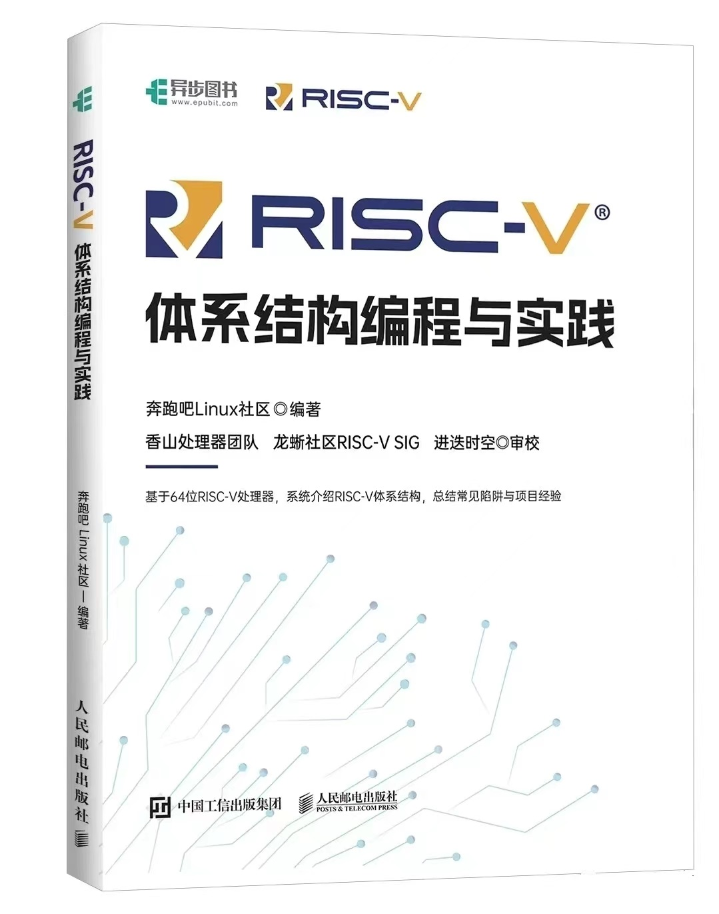
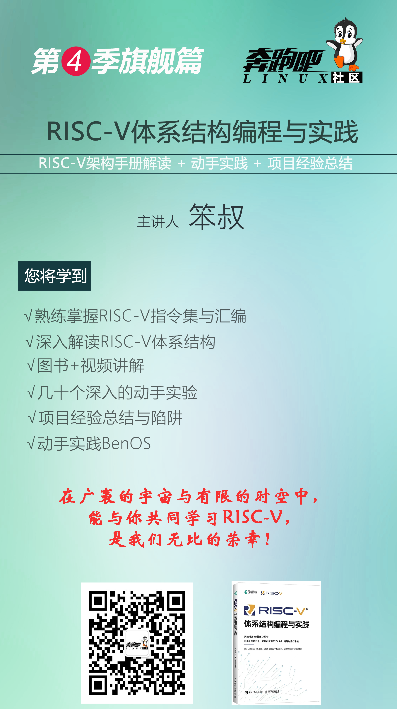

# 新书《RISC-V体系结构：编程与实践》

本repo是《RISC-V体系结构编程与实践》一书的配套实验参考代码和勘误。    
1. master分支：是本书默认的实验参考代码，基于QEMU和NEMU。     
2. DongShanPI_D1分支：基于[DongShangPI D1s开发板](https://item.taobao.com/item.htm?&id=695941169493)验证过的实验参考代码，由韦东山团队提供技术支持。    

图书购买地址: https://item.jd.com/13629613.html

订阅视频课程，请用微信扫描下面二维码。     

# 本书特色：
1. 讲解最新的RISC-V架构
2. 理论和实践兼顾
3. 突出动手实践，几十个有趣和有深度实验
4. 基于QEMU/NEMU/spike为实验平台
5. 总结常见陷阱与项目经验

# 实验参考代码说明

实验参考代码仅供读者做实验参考使用。

本仓库的另外一个镜像地址：    
https://gitee.com/benshushu/riscv_programming_practice    
https://github.com/runninglinuxkernel/riscv_programming_practice   

# 实验平台与实验环境说明

本书所有配套实验默认采用如下两个免费的模拟器：      
1）QEMU   
2）香山模拟器NEMU     

我们推荐使用我们提供的VMware/VirtualBox镜像，下载方式：关注“奔跑吧Linux社区”微信公众号，输入“risc-v”获取下载地址。   
配置如下：
1. 主机硬件平台：Intel x86_64处理器兼容主机。
2. 主机操作系统：Ubuntu Linux 20.04。
3. GCC版本：9.3（riscv64-linux-gnu-gcc）。
4. QEMU版本：4.2.1

# RISC-V视频课程

我们根据本书的目录制作了视频课程，为读者提供 **图书 + 视频课程 + 实验** 的多维度的教学体验。订阅视频课程，请用微信扫描下面二维码。

#  RISC-V原生笔记本
如果读者想体验RISC-V原生笔记本，可以购买全球首款RISC-V笔记本ROMA，内置4核高性能处理器，采用12nm/28nm封装，支持GPU，NPU等加速功能, 支持多款流行的Linux发行版。

[了解ROMA笔记本](https://deepcomputing.io/roma-first-native-riscv-laptop/)

# 开发板
读者如果想购买与本书实验适配的开发板，推荐韦东山团队制作的DongShanPI D1s开发板。 

[DongShanPI D1s + RISC-V图书套餐 购买链接](https://item.taobao.com/item.htm?&id=695941169493)

本repo中的DongShanPI_D1分支是由韦东山团队提供的，基于D1开发板适配本书的实验参考代码。(开发板相关问题请咨询[百问网科技](https://www.100ask.net/))。   

# 目录
第1章 RISC-V介绍  
第2章 搭建实验环境    
第3章 RISC-V基础指令集   
第4章 过程调用与栈   
第5章 GNU汇编器   
第6章 链接器   
第7章 GCC内嵌汇编   
第8章 异常处理   
第9章 中断处理   
第10章 内存管理   
第11章 高速缓存基础知识   
第12章 缓存一致性    
第13章 TLB管理    
第14章 原子操作    
第15章 内存屏障   
第16章 高速缓存与内存屏障   
第17章 操作系统相关话题     
第18章 可伸缩矢量计算RVV    
第19章 压缩指令扩展     
第20章 虚拟化  

# 其他参考书

《Arm64体系结构编程与实践》一书已经于2022年4月在人邮出版社出版，有兴趣的小伙伴可以先阅读此书。  

资料下载： 关注“奔跑吧linux社区”微信公众号，输入“arm64”领取。

https://github.com/runninglinuxkernel/arm64_programming_practice

# 其他视频课程
配套视频课程由奔跑吧Linux社区录制完成。   
购买地址：     
1. 用微信扫描下面二维码，进入“奔跑吧Linux社区”店铺。    
      

2. 淘宝店铺： https://shop115683645.taobao.com/   
3. 微店：https://weidian.com/?userid=1692165428   

1. 第3季课程海报

2. 第3季课程目录

3. 第1季课程目录

4. 第2季课程目录

5. 线下布道与培训

奔跑吧Linux社区可以为广大企业提供线下线上培训与布道，提供两大部分的课程内容：
1. ARM64（ARMv8和v9架构）体系结构与编程  
2. RISC-V体系结构与编程  
3. Linux内核/驱动开发与调试  

讲师：奔跑吧Linux社区金牌讲师  
有兴趣的可以联系：runninglinuxkernel@126.com    
或者微信号: runninglinuxkernel   
