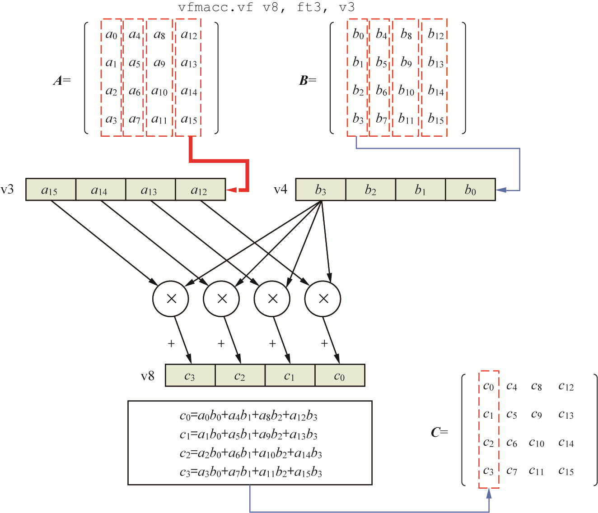

# 

亲爱的小伙伴:  
感谢您选购和阅读《RISC-V体系结构编程与实践》，感谢您对奔跑吧Linux社区的长期支持！由于我们水平有限，出书时间仓促，难免有不少勘误，我们深感歉意，也恳请大家多多包涵，也欢迎给我们提出批评和建议！我们会不久的将来第2版中继续完善和优化！如果发现有新的勘误或者有好建议，请通过如下方式与我们联系：
邮件：runninglinuxkernel@126.com   
微信公众号：奔跑吧linux社区   
微信号：runninglinuxkernel   
请读者在阅读本书之前，一定要先阅读书最前面的“本书约定”一文。

PDF版本的勘误 下载方法：
关注“奔跑吧linux社区”微信公众号，在微信公众号里输入“risc-v”获取下载地址。

订阅配套视频课程：        
1. 微信打开：https://appv6qgydb09376.h5.xiaoeknow.com      
2. 关注“奔跑吧Linux社区”微信公众号，输入“risc-v”进入在线学习平台    

# 勘误

勘误按照发现的时间为顺序, 其中Fixed表示在第几次印刷中修复了。

| 页码 | 位置 | 原内容                             | 修改后的内容                         | Fixed  |
| ---- | -------- | ---------------------------------- | ------------------------------------ | ------ |
| 375    | 图18.23 | -  | 修改见红色部分    | 3|
|383-384|  注释 | - | 代码45行注释改成：计算C2   代码56行注释改成：计算C3| 3|
| 386 | 图18.30| - | 图上最上方v9改成v8，如下所示：vfmacc.vf v8, ft2, v2| 3| 
|406| - | hlv{x}.{b\|\|h\|w\|d}{u} rd,  offset(rs1) | b和h之间应该用“\|” | 3|
|411| 图20.16| - | 图中的SGEIP改成SGEIE，VSEIP改成VSEIE | 3|
|427| 图20.21 | - | 图中的imm[11:0] 更正为 imm[11:5] | 3|
|436 | - | 例如，Mem8 addr表示内存地址addr中的8位数据。| Mem8 addr 改成 Mem8(addr) | 3|
| 139| 第8.4章| spec寄存器的值| sepc寄存器的值 | 3|
| 74| - |根据ra寄存器的返回地址，跳转到上一级函数（即func1()函数通过JAR指令调用add_c()函数的下一条指令）。| JAR指令改成JAL指令|3|
| 30| -| 表2.1的信息都可以在NEMU配置菜单中配置。| 表2.1 改成 表2.3| 3|
| 38| 表2.5中第4行| 0b0001  预分频寄存器中的高8位| 0b0001 改成 0b001| 3|
|61| 倒数第二段|在第1行中，交换tp和sscratch寄存器的值，即读取sscratch寄存器的旧值| "交换tp和sscratch寄存器的值"半句去掉| 3| 
| 386| 图18.31| - | 修改见红色加粗部分   | 3|  
| 65| 实验3-3 | 从0x802 0000地址复制32字节到0x8021 0000地址处 | 0x802 0000 改成 0x8020 0000 | 3|
|132| 第二段| mpec：记录发生异常的指令地址。| mpec 改成 mepc| 3|

# 补充

这里列出的不是勘误，是有益的补充，可能会对读者理解有帮助。

| 页码 |   位置   |         原内容    |                补充的内容           | 
| ---- | -------- | ------------------| ------------------------------------|
| 262    | 14.2章 | -  | 在14.2章补充如下内容     LR和SC指令是配对使用，SC指令成功的条件，一是当前保留集有效，二是保留集中包含的数据被成功更新或者写入。无论SC指令执行成功与否，当前CPU包含的保留集都被无效掉。      有如下情况SC指令会失败。   1. 如果SC写入的地址，不在与之配对的LR指令组成的保留集范围内。   2. 如果在LR和SC指令范围内，执行了另外一条SC指令,不管写入任何地址，都会导致SC指令执行失败.   3. 如果在LR和SC指令范围内，执行了另外一条store指令。这相当于是在LR/SC配对的序列中，又插入了一条store指令，并且这条store指令是对LR的加载地址进行store的话，那SC指令会执行失败。如果这条store指令不是对LR加载地址进行store的话，SC指令不会失败。   4. 如果另外一个CPU对当前LR和SC的保留集地址进行写入操作。   5. 如果另外一个外设（不是CPU）对LR加载的数据进行写入     RISC-V架构对LR/SC序列做了一些约束，不符合这些约束的LR/SC序列不能保证在所有RISC-V处理器中都能成功。   1. LR/SC的循环loop中最多包含16条指令   2. LR/SC序列包括RV64I指令或者压缩指令，但是不包括加载、存储、向后跳转、向后分支、JALR、FENCE、以及SYSTEM指令。   3. LR/SC序列可以包含向后跳转的retry重试。   4. SC指令的地址必须与同一个CPU执行的最新LR的有效地址和数据大小相同。| 
| 262  | 14.2章 | - |  如果在LR和SC序列中发生了进程切换，那么LR/SC还能成功吗?     目前不少RISC-V芯片采用类似arm的exclusive monitor的方式，那么在异常返回时，RTL可以清除local监视器。一个进程的切换，必定发生了一次时钟中断。中断也是异常的一种。所以，这样就可以保证进程切换时，LR申请的reservation set被作废了。     另外还可以采用软件方式来清除local监视器。例如最新的Linux内核，在异常返回的时候， 对异常返回地址执行了一条SC指令（读异常返回地址的值，然后用SC指令往异常返回地址里写 刚才读回来的内容），这样就可以无效掉LR/SC组成的保留集，达到清除reservation set的目的.     在RISC-V架构手册卷1的第8.2章里有提到，使用SC指令对一块可以被抓破的内存进行写入 (也可以是任何地址。Linux内核异常返回时的做法是：读异常返回地址的值，然后用SC指令往异常返回地址里写 刚才读回来的内容)，用来无效掉已经加载的保留集，主要用途：   1. 进程切换   2. 修改了VA->PA映射，并且这页面包含了一个活跃的保留集。|
